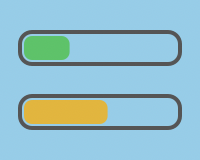

# ClaudeUsage

macOS menu bar app to monitor your Claude Pro/Max rate limits.

|  |  |  |
|---|---|---|
| *Top bar: 5-hour session / Bottom bar: 7-day weekly* ||

## Features

- Two stacked bars: 5-hour session + 7-day weekly limits
- Color-coded: green (<50%), yellow (50-80%), red (>80%)
- Auto-refresh every 3 minutes
- OAuth login with Claude account
- Secure token storage in macOS Keychain

## Install

**Download** from [Releases](https://github.com/peter-jammable/mac-menu-bar-claude-usage/releases/latest) or build from source:

```bash
brew install xcodegen
git clone https://github.com/peter-jammable/mac-menu-bar-claude-usage.git
cd mac-menu-bar-claude-usage
xcodegen generate
open ClawUsage.xcodeproj
```

## Requirements

- macOS 13.0+
- Claude Pro or Max subscription

## License

MIT
